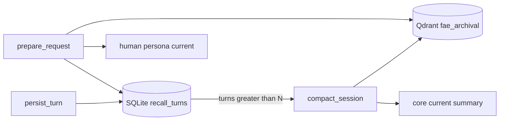

# Phase 2.3 · 统一 Recall + 首版 Archival

> Status: ready to implement  
> Base: `init` @ `e8fa7a0` (clean, pushed)

## Review (current HEAD)

**Shipped and healthy enough for next work:**

- Phase 2.1–2.2 memory path (WS/HTTP + Daily seed/persist)
- Hardening (`0399ad3`): Daily turn clear, memory processor after LLM, client memory session id
- Compose already runs Qdrant (`qdrant:6333`); config has `qdrant_url`

**Gaps blocking clean 2.3:**

| Gap | Detail |
|---|---|
| Dual Recall backends | `embedded.recall_turns` vs Letta archival/current masquerade |
| No compaction | Long sessions only grow `[recent_turns]` |
| No real Archival | Qdrant unused by app code |
| No Core budget | persona/human/current unbounded |
| Episodic / UI / sleeptime | Out of this slice |

## Goal (this slice only)

Unify short-term Recall on SQLite; when a session exceeds N turns, compact oldest turns into Qdrant `fae_archival`; expose Core char/token stats. Defer Episodic, sleeptime, memory browser UI.

## Implementation plan

### 1. Shared RecallStore

- Add [`backend/src/fae/memory/recall_store.py`](../backend/src/fae/memory/recall_store.py)
- SQLite schema: `recall_turns(id, session_id, user_text, assistant_text, created_at, archived_at nullable)`
- Path: `Settings.recall_db_path` default `.data/fae-recall.db`
- Both `EmbeddedMemoryClient` and `LettaMemoryClient` delegate `append_recall` / `list_recall` here (Letta keeps core blocks only)

### 2. Compaction + Archival

- Add `archival.py` (Qdrant collection `fae_archival`) + `compaction.py`
- Config: `recall_max_turns=30`, `recall_compact_batch=10`
- On `persist_turn` after append: `maybe_compact(session_id)` best-effort
- Embedding: DashScope `text-embedding-v3` when `DASHSCOPE_API_KEY` set; else deterministic stub vectors for tests/offline
- Compacted turns: write summary passage to Qdrant, set `archived_at` or delete from hot window

### 3. Core budget + API

- Helper to measure persona/human/current char length and `tokens≈chars/4`
- Truncate `current` only when over limit (do not auto-trim human)
- `GET /api/memory/stats` → `{ recall_turns, core: {persona, human, current}, archival: ok|down|stub }`

### 4. Prompt injection

- `recall_for_prompt`: `[human]` → `[current]` → `[recent_turns]` (hot SQLite) → `[facts]` (include archival search top-k)

### 5. Tests & docs

- Unit: RecallStore, compact when >N, archival stub search in inject
- Optional: Qdrant integration marked `@pytest.mark.integration`
- Update `DEVELOPMENT_PLAN.md` 2.3 checkboxes (Recall + Archival first cut; Episodic still open)
- README one-liner for compaction / Qdrant

## Out of scope

- Episodic event graph (`episodic.py`)
- sleeptime scheduler (2.4)
- Memory browser UI (2.5)
- Daily per-turn re-seed (nice-to-have later)

## Acceptance

1. Same `session_id`: inject >N turns → hot SQLite count capped; archival has summaries  
2. Ask about an early topic → hit via `[facts]` / archival keyword or vector  
3. `uv run pytest` coverage ≥ 80% without requiring live Letta image  
4. `GET /api/memory/stats` returns core sizes

## Suggested commit sequence

1. `feat(memory): shared SQLite RecallStore for both clients`  
2. `feat(memory): compact recall into Qdrant archival`  
3. `feat(api): /api/memory/stats + core budget`  
4. docs + plan checkbox update
