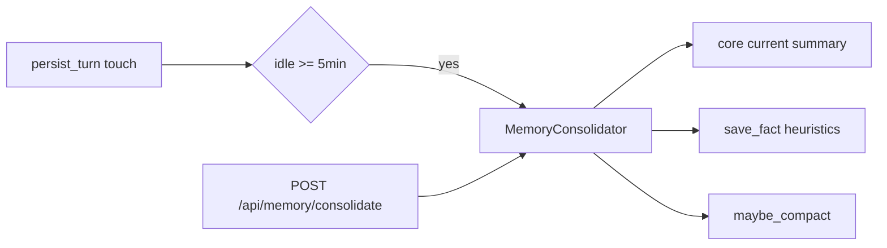

# Phase 2.4 · sleeptime 记忆整理

> Status: implemented  
> Base: `init` @ `05349cf` (Phase 2.3 shipped)

## Goal

Idle / on-demand consolidation that summarizes hot Recall into Core `current`
(+ durable facts), without blocking chat turns. Episodic (2.3 leftover) and
memory UI (2.5) stay out of scope.

## Slice

1. `consolidation.py` — heuristic summarize (no live LLM required for unit tests)
2. `SleeptimeScheduler` — background poll; touch on `persist_turn`; max 30s / run
3. `POST /api/memory/consolidate?session_id=` — smoke / ops
4. Config: idle / poll / max runtime / min interval / enable flag
5. Tests + DEVELOPMENT_PLAN checkboxes

## Out of scope

- Episodic event graph
- LLM-powered summarizer (optional follow-up when DashScope key present)
- Memory browser UI
- Redis-backed distributed locks
